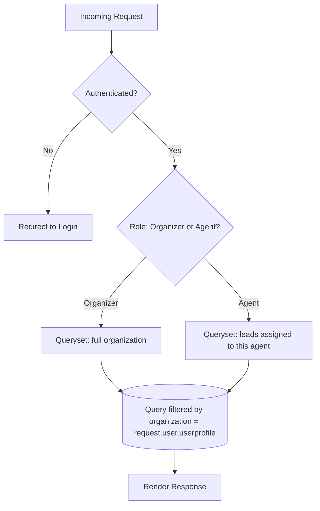
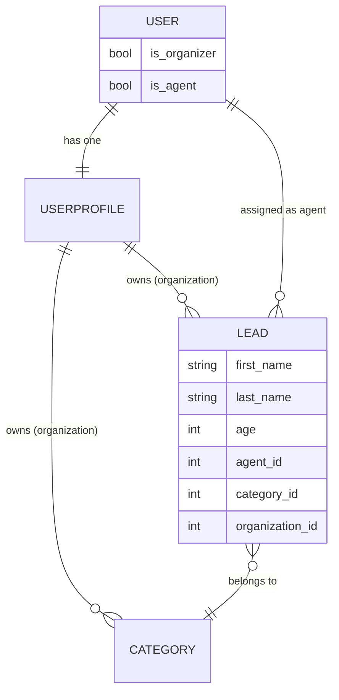
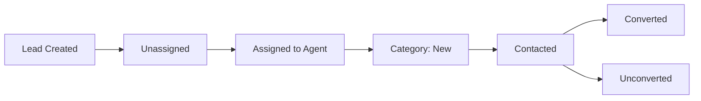

<div align="center">

# CRM for Organizations

### A multi-tenant, role-based CRM platform — built to show how real SaaS systems isolate data, not just how to CRUD leads.

[](LICENSE)
[](https://www.python.org/)
[](https://www.djangoproject.com/)
[](https://tailwindcss.com/)
[](CONTRIBUTING.md)
[](https://github.com/AhmadHussainRandhawa/crm-for-organizations/commits/main)

**[Overview](#overview) · [Architecture](#architecture) · [Features](#core-features) · [Design Decisions](#design-decisions--trade-offs) · [Getting Started](#getting-started) · [Roadmap](#roadmap) · [Contributing](#contributing)**

</div>

<br>

## Overview

Every Django CRM tutorial teaches you to build a `Lead` model, a `ListView`, and call it done. This project answers a harder, more interesting question:

> **How do you build one application that safely serves many organizations, where each organization's data must be completely invisible to every other organization — without giving every tenant their own database?**

That question is the actual engineering problem behind every B2B SaaS product you've ever used. This repo is a small, readable, fully-working answer to it, built in Django with nothing exotic — no paid multi-tenancy library, no schema-per-tenant complexity. Just disciplined query-layer isolation, a real role system, and a lead pipeline that behaves the way sales teams actually work.

**Read this repo if you want to see:**
- How row-level multi-tenancy is enforced *at the query layer*, not just hidden in the UI
- A permission system with two genuinely different roles, not a single `is_staff` flag doing all the work
- How Django signals keep tenant provisioning (`UserProfile` creation) decoupled from your views
- A believable end-to-end workflow: lead created → assigned → worked → converted

### Who this is for

- Backend engineers learning how **multi-tenant SaaS architecture** actually gets implemented, beyond the theory
- Django developers who want a **realistic, non-trivial reference project** to read, extend, or fork
- Contributors who want to practice working with **role-based access control** and **organization-scoped querysets** in a real codebase

---

## Project Preview

| Dashboard | Lead Management |
|---|---|
|  |  |

| Agent Management | User Management |
|---|---|
|  |  |

---

## Architecture

### Tenant isolation, request to response

Every request is resolved through the same funnel: authenticate, resolve role, scope the queryset to the user's organization. There is no code path that returns data without passing through the organization filter.



### Data model



`UserProfile` is the tenant boundary. Every `Lead` and `Category` carries a foreign key to it — that single relationship is what makes every other isolation guarantee in this app possible.

### Lead lifecycle



---

## Core Features

### Role-based access

| Capability | Organizer | Agent |
|---|:---:|:---:|
| Create / manage agents | ✅ | ❌ |
| Create & assign leads | ✅ | ❌ |
| Manage lead categories | ✅ | ❌ |
| View organization-wide data | ✅ | ❌ |
| View & work assigned leads | ✅ | ✅ |
| Move leads through pipeline stages | ✅ | ✅ |

### Multi-tenant by construction

Every meaningful object — `Lead`, `Agent`, `Category` — is scoped to an organization at the database level, not filtered client-side. The result:

```python
# There is no "trust the frontend" path here.
# Every data-access query is organization-scoped, always.
Lead.objects.filter(organization=request.user.userprofile)
```

- Organizations can never see each other's data, by construction, not convention
- Agents only ever see leads explicitly assigned to them
- The same codebase scales to any number of tenants with zero schema changes

### Agent onboarding, not just agent creation

Creating an agent is a small workflow, not a form submission:

1. A `User` account is generated for the agent
2. The agent is linked to the organizer's organization
3. An invitation email is dispatched automatically

### Authentication & access control

- Custom `User` model extends `AbstractUser` with `is_organizer` / `is_agent` flags — roles are first-class, not bolted on
- A `UserProfile` is created automatically for every new user via a Django **signal**, decoupling tenant provisioning from view logic entirely
- Access is enforced in three layers: login gates → role-based permission mixins → organization-scoped queryset filtering

---

## Design Decisions & Trade-offs

Worth reading before you extend this project — these are the calls that shaped it, and why.

**Row-level multi-tenancy over schema-per-tenant.**
Every tenant shares one database and one schema; isolation happens through an `organization` foreign key on every tenant-owned model. This keeps migrations, backups, and local development trivial — there's exactly one schema to reason about. The trade-off: a single missed `.filter(organization=...)` anywhere in the codebase is a real data leak. This is a conscious bet that code review discipline and consistent query patterns beat the operational complexity of schema-per-tenant or database-per-tenant isolation at this scale. If this were serving thousands of large enterprise tenants with strict compliance requirements, that trade-off would likely flip.

**Signals for `UserProfile` provisioning over overriding `User.save()`.**
Using `post_save` keeps tenant setup out of the `User` model and out of view code — new users get a profile no matter where they're created (admin, shell, signup form, management command). The trade-off is the classic one with signals: the side effect is implicit, which can surprise a new contributor reading `views.py` and wondering where `userprofile` came from. It's documented here for exactly that reason.

**Server-rendered Django templates over an API-first SPA.**
For a project meant to be *read* and learned from, keeping the request/response cycle in one language and one framework lowers the barrier to understanding the whole system. The trade-off is real, though: there's no API layer today, which is why a DRF API is the top item on the roadmap — it's the natural next step once the core domain model is stable.

---

## Tech Stack

| Layer | Technology |
|---|---|
| Backend | Python, Django |
| Frontend | Django Templates, Tailwind CSS |
| Database | SQLite (development) |
| Dev Tooling | django-tailwind, django-browser-reload |

---

## Engineering Highlights

- **Custom User Model** — role-based behavior extends `AbstractUser` directly, so roles are queryable, filterable, first-class fields
- **Class-Based Views** — `ListView`, `DetailView`, `CreateView`, `UpdateView`, `DeleteView`, `FormView` used consistently for predictable, reusable view logic
- **Dynamic Forms** — the agent-assignment form filters its agent queryset by the logged-in user's organization at render time, so an organizer can never even see another org's agents in a dropdown
- **Signals** — `UserProfile` creation is fully decoupled from view and form logic
- **Email Notifications** — dispatched on agent creation and lead creation, simulating real CRM notification behavior

---

## Project Structure

```
crm-for-organizations/
│
├── agents/               # Agent management — views, forms, mixins, templates
├── leads/                # Lead & category management — models, views, forms, tests
├── crm/                  # Core project config — settings, urls, wsgi/asgi
├── templates/            # Shared templates — base, navbar, registration
├── static/               # Static assets — css, js
├── theme/                # Tailwind CSS configuration & source styles
├── docs/screenshots/     # README preview images
├── requirements.txt
└── manage.py
```

---

## Getting Started

### Prerequisites

- Python 3.12+
- Node.js (for Tailwind CSS compilation)

### Installation

```bash
# Clone the repository
git clone git@github.com:AhmadHussainRandhawa/crm-for-organizations.git
cd crm-for-organizations

# Create and activate a virtual environment
python -m venv venv
source venv/bin/activate    # On Windows: venv\Scripts\activate

# Install dependencies
pip install -r requirements.txt

# Apply migrations
python manage.py migrate

# Create an admin (Organizer) account
python manage.py createsuperuser

# Run the development server
python manage.py runserver
```

Visit `http://127.0.0.1:8000`.

### Tailwind CSS setup

```bash
cd theme/static_src
npm install
cd ../..
python manage.py tailwind start
```

### Running tests

```bash
python manage.py test
```

---

## Example Workflow

1. Organizer signs up and lands on their organization dashboard
2. Organizer creates one or more agents → invitation emails sent
3. Organizer creates leads → leads start as **unassigned**
4. Organizer assigns leads to agents
5. Agents log in and see only their assigned leads
6. Agents move leads through pipeline categories as they work them

---

## Roadmap

Contributions toward any of these are especially welcome — they're ranked roughly by how much they extend the core architecture vs. add surface area:

- [ ] **REST API** via Django REST Framework — the natural next layer given the current domain model
- [ ] **Lead activity history / audit trail** — who changed what, when
- [ ] **Rich-text lead notes & file attachments**
- [ ] **Real email provider integration** (SendGrid / Mailgun / SMTP) — currently simulated
- [ ] **Dashboard analytics & pipeline KPIs**
- [ ] **Real-time notifications** via WebSockets
- [ ] **Docker-based dev & production deployment**
- [ ] **PostgreSQL** as the production database target

---

## FAQ

**Is this production-ready?**
Not as-is — it's a reference implementation optimized for clarity, not a hardened SaaS backend. SQLite, simulated emails, and no rate limiting all need to change before production use. It's an excellent *foundation* to harden, not a finished product.

**Why not use `django-tenants` or another multi-tenancy package?**
Because the point of this repo is to make the isolation pattern visible and understandable, not abstracted behind a library. Once you understand *why* every query needs `organization=...`, using a package that automates it is a much more informed decision.

**Can I use this as a starting point for my own SaaS?**
Yes — that's exactly the intent. Fork it, rip out what you don't need, and treat the multi-tenancy and role-based access patterns as the part worth keeping.

---

## Contributing

Contributions, issues, and feature requests are genuinely welcome. See [CONTRIBUTING.md](CONTRIBUTING.md) for the branching model, commit conventions, and PR process before opening a pull request.

---

## License

Distributed under the [MIT License](LICENSE).

---

## Contact

**Ahmad Hussain Randhawa**

- Email: official.ahmadrandhawa@gmail.com
- LinkedIn: [ahmad-hussain-randhawa](https://www.linkedin.com/in/ahmad-hussain-randhawa/)
- GitHub: [@AhmadHussainRandhawa](https://github.com/AhmadHussainRandhawa)

Questions or collaboration ideas are always welcome — feel free to reach out.
