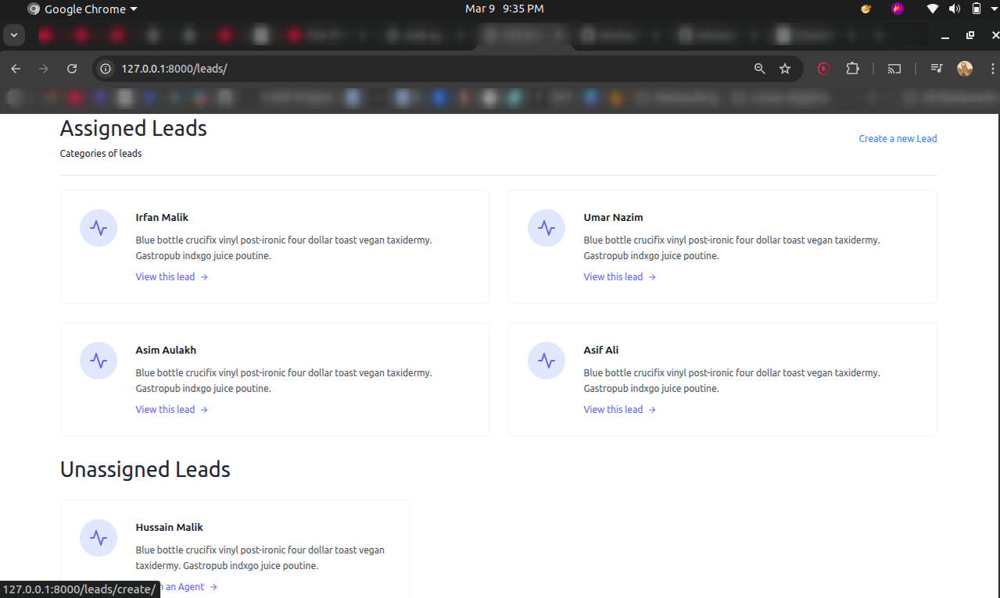
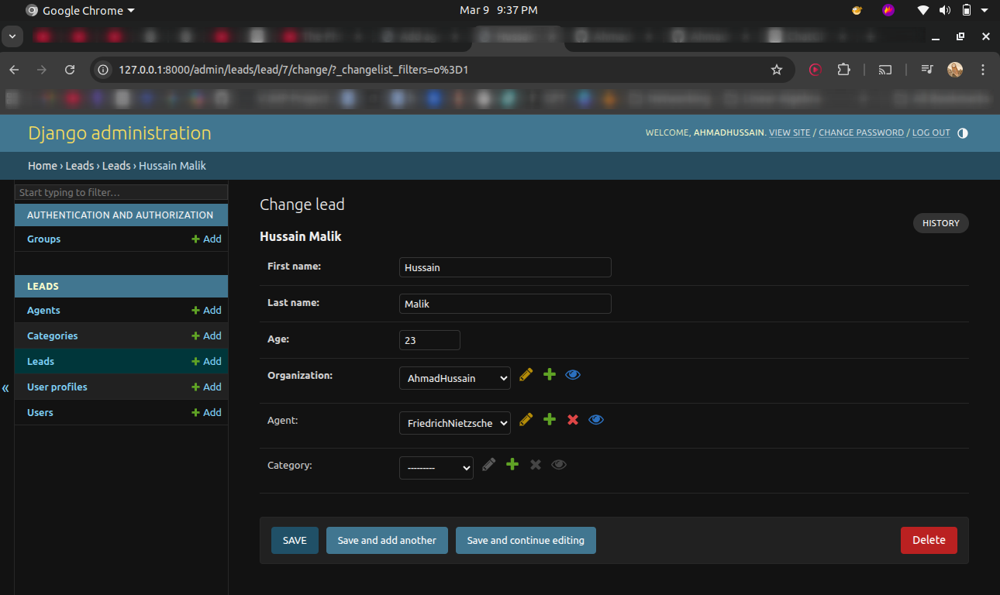
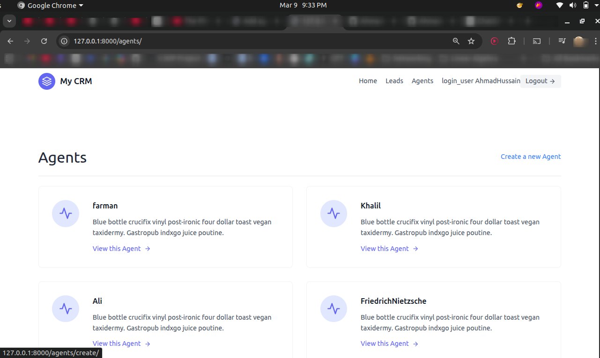
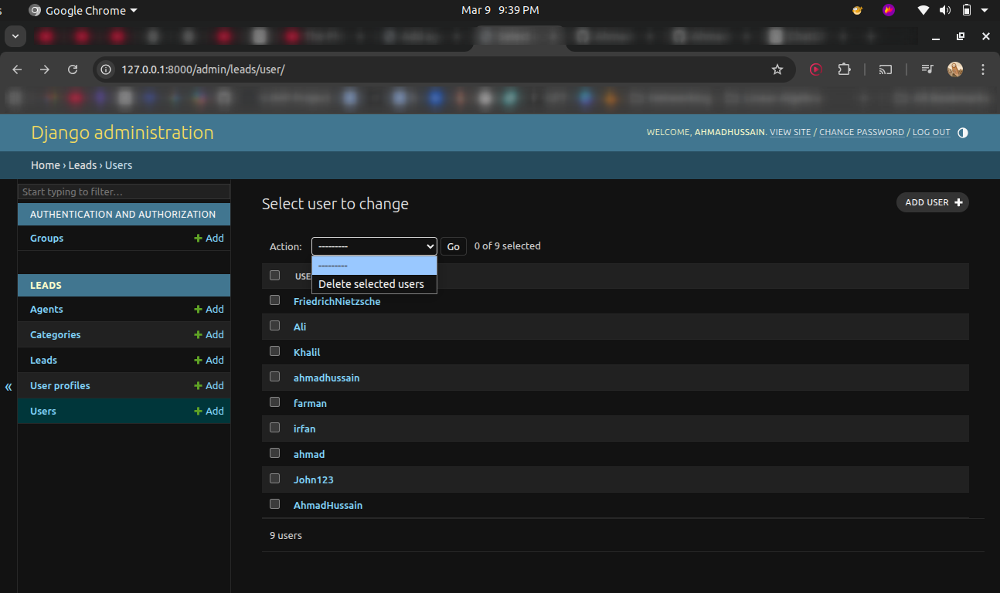

# CRM for Organizations

A **multi-user Customer Relationship Management (CRM) platform** built with Django that allows organizations to manage leads, assign sales agents, and track sales pipeline stages.

This project demonstrates how to design a **role-based, multi-tenant business application** where organizations manage teams and teams manage leads.

It reflects the architecture commonly used in **real SaaS CRM systems**.

---

# Project Preview

## Dashboard



---

## Lead Management



---

## Agent Management



---

## User Management



---

# Core Features

## Role-Based Access System

The system defines two user roles.

### Organizer

Organizers act as administrators of the organization.

Capabilities:

- create agents
- create and manage leads
- assign leads to agents
- manage lead categories
- view all organization data

---

### Agent

Agents are responsible for working on assigned leads.

Capabilities:

- view assigned leads
- track leads through categories

Agents cannot create agents or manage organization configuration.

---

# Multi-Tenant Architecture

The system isolates data per organization.

Every important object belongs to an organization:

- Leads
- Agents
- Categories

This ensures:

- organizations cannot see each other's data
- agents only access leads assigned to them
- the platform can scale to support multiple organizations

This pattern is widely used in **SaaS platforms**.

---

# Lead Management System

Leads represent potential customers.

Each lead contains:

- first name
- last name
- age
- assigned agent
- category
- organization

Leads can be created, edited, deleted, and assigned to agents.

---

# Lead Assignment Workflow

Leads are distributed across agents through an assignment workflow.

Typical flow:

1. Organizer creates a lead
2. Lead appears as **unassigned**
3. Organizer assigns the lead to an agent
4. The agent can now work on that lead

This models how real sales teams distribute incoming prospects.

---

# Lead Categorization

Leads can be organized into pipeline stages such as:

- New
- Contacted
- Converted
- Unconverted

Categories allow teams to track **sales progress and lead status**.

---

# Agent Management

Organizers can manage their sales team directly from the system.

They can:

- create agents
- update agent information
- remove agents
- monitor agent assignments

When an agent is created:

- a user account is generated
- the agent is linked to the organization
- an invitation email is sent

---

# Authentication System

The project uses Django authentication with a **custom user model**.

Additional attributes define user roles:

- `is_organizer`
- `is_agent`

Each user automatically receives a **UserProfile** representing their organization.  
This is handled using a **Django signal**.

---

# Access Control

Access control is implemented through:

- login protection
- role-based permission checks
- organization-scoped query filtering

This ensures users cannot access data outside their organization.

---

# Tech Stack

Backend

- Python
- Django

Frontend

- HTML Templates
- Tailwind CSS

Database

- SQLite (development)

Development Tools

- Django Tailwind
- Django Browser Reload

---

# Engineering Highlights

This project demonstrates several important backend engineering concepts.

### Custom User Model

The system extends Django's `AbstractUser` to support role-based behavior.

---

### Class-Based Views

The application uses Django generic class-based views such as:

- ListView
- DetailView
- CreateView
- UpdateView
- DeleteView
- FormView

This promotes clean architecture and reusable code.

---

### Organization-Level Query Filtering

Data access is restricted using filtered querysets.

Example pattern:

Lead.objects.filter(organization=request.user.userprofile)

This prevents users from accessing data outside their organization.

---

### Dynamic Forms

Forms dynamically filter available agents based on the logged-in user's organization.  
This ensures correct assignment workflows.

---

### Signals

A Django signal automatically creates a `UserProfile` whenever a new user is created.

---

### Email Notifications

Email notifications are triggered when:

- a new agent is created
- a lead is created

This simulates real CRM workflow notifications.

---

# Project Structure

```text
crm/
│
├── agents/              # Agent management
│   ├── views.py
│   ├── forms.py
│   ├── mixins.py
│   └── templates/
│
├── leads/               # Lead and category management
│   ├── models.py
│   ├── views.py
│   ├── forms.py
│   ├── urls.py
│   └── tests/
│
├── templates/           # Shared templates
│   ├── base.html
│   ├── navbar.html
│   └── registration/
│
├── static/              # Static files
│   ├── css/
│   └── js/
│
├── theme/               # Tailwind configuration
│
└── crm/                 # Core project configuration
    └── settings.py
```

# Installation

Clone the repository:

```bash
git clone git@github.com:AhmadHussainRandhawa/crm-for-organizations.git
cd crm-for-organization
```

Create a virtual environment and activate it:

```bash
python -m venv venv
source venv/bin/activate
```

Install Python dependencies:

```bash
pip install -r requirements.txt
```

Apply database migrations:

```bash
python manage.py migrate
```

Create a Django superuser:

```bash
python manage.py createsuperuser
```

Run the development server:

```bash
python manage.py runserver
```

---

# Tailwind Setup

Install Node dependencies for the Tailwind theme:

```bash
cd theme/static_src
npm install
```

Start the Tailwind watcher (development):

```bash
python manage.py tailwind start
```

---

# Running Tests

Run the test suite:

```bash
python manage.py test
```

---

# Example Workflow

1. Organizer signs up  
2. Organizer creates agents  
3. Agents receive invitation emails  
4. Organizer creates leads  
5. Leads appear as unassigned  
6. Organizer assigns leads to agents  
7. Agents manage assigned leads  
8. Leads move through categories

---

# Future Improvements

Possible improvements include:

- REST API with **Django REST Framework**
- Lead activity tracking (history/audit)
- Lead notes and comments (rich text, attachments)
- Email integration with external providers (SendGrid, Mailgun, SMTP)
- Dashboard analytics and KPIs
- WebSocket notifications for real-time updates
- Docker-based deployment (dev & production)
- Migrate to PostgreSQL for production

---

# License

MIT License

---

# Let's Connect 💀 
[  LinkedIn Profile](https://www.linkedin.com/in/ahmad-hussain-randhawa/)  
[  GitHub Profile](https://github.com/AhmadHussainRandhawa)   
[ official.ahmadrandhawa@gmail.com](mailto:official.ahmadrandhawa@gmail.com)   
